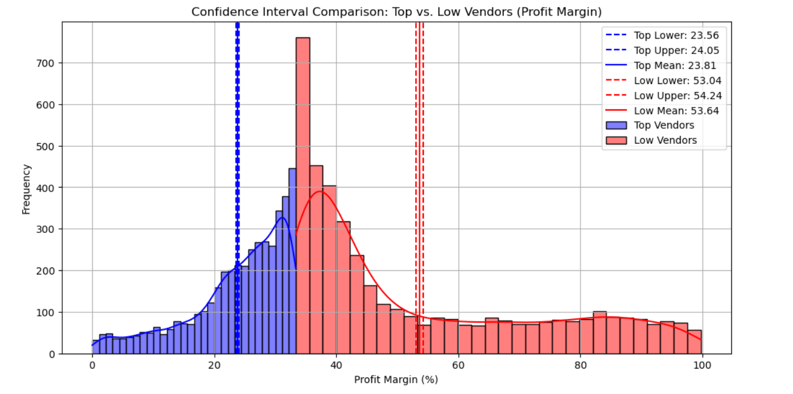
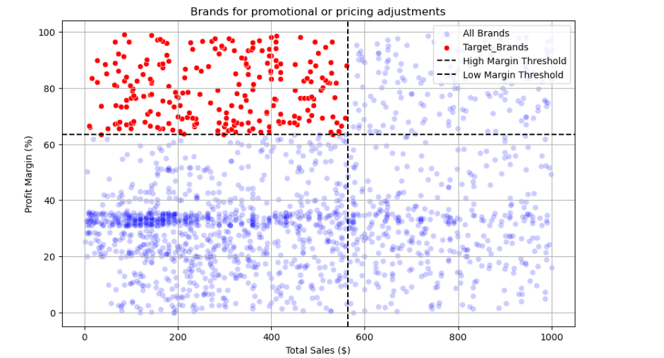
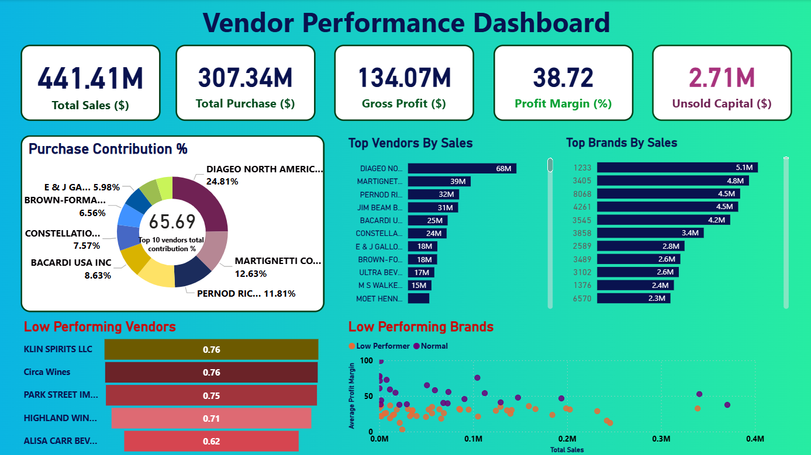

# Vendor Performance Analytics Dashboard

This project analyzes vendor performance using sales, purchase, and inventory data.  
The goal is to identify top-performing vendors, detect low-performing vendors, and analyze profitability patterns using statistical analysis and data visualization.

The project combines **Python, statistical analysis, and Power BI** to generate actionable business insights.

---

# Project Overview

This project performs:

- Vendor performance analysis
- Profitability analysis
- Vendor contribution analysis
- Statistical hypothesis testing
- Interactive dashboard visualization

---

# Tools & Technologies

- Python (Pandas, NumPy)
- Statistical Analysis (SciPy)
- Data Visualization (Matplotlib, Seaborn)
- Power BI
- GitHub

---

# Project Workflow

1. Data Cleaning and Preparation
2. Feature Engineering
3. Exploratory Data Analysis
4. Statistical Analysis
5. Power BI Dashboard Development

---

# Feature Engineering

### Profit Margin Calculation

Profit margin was calculated using the following formula:

ProfitMargin = (SalesPrice − PurchasePrice) / SalesPrice × 100

This metric helps evaluate vendor profitability.

---

# Hypothesis Testing

A **two-sample t-test** was performed to determine whether there is a statistically significant difference in profit margins between top-performing vendors and low-performing vendors.

### Null Hypothesis (H0)

There is **no significant difference** in profit margins between top vendors and low vendors.

### Alternative Hypothesis (H1)

There **is a significant difference** in profit margins between the two groups.

### Decision Rule

If **p-value < 0.05**, the null hypothesis is rejected.

---

# Confidence Interval Analysis

A **95% confidence interval** was calculated to estimate the average profit margin range for both vendor groups.

### Visualization

Interpretation:

The plot shows the distribution of profit margins for top vendors and low vendors.  
The dashed vertical lines represent the confidence interval bounds and mean values.

---

# Brand Performance Analysis

A scatter plot was used to analyze the relationship between **total sales and profit margin across brands**.

Insights:

- Some brands have **high sales but low profit margins**
- Some brands have **high margins but lower sales**
- This analysis helps identify brands that may require pricing adjustments or promotional strategies.

---

# Vendor Purchase Contribution

Vendor purchase contribution analysis helps identify which vendors dominate procurement spending.

Key Insight:

The **top 10 vendors contribute approximately 66% of total purchases**, indicating strong supplier concentration.

---

# Power BI Dashboard

An interactive Power BI dashboard was created to visualize vendor performance and key business metrics.

The dashboard includes:

- Total Sales
- Total Purchases
- Gross Profit
- Profit Margin
- Unsold Capital
- Top Vendors by Sales
- Top Brands by Sales
- Low Performing Vendors
- Brand Profitability Analysis

---

# Key Business Insights

- Total Sales: **$441M**
- Gross Profit: **$134M**
- Profit Margin: **38.72%**
- Unsold Capital: **$2.71M**

Additional insights:

- A small number of vendors dominate procurement spending
- Certain vendors show **low inventory turnover**
- Some brands have **pricing inefficiencies**

---

# Business Value

This analysis can help organizations:

- Optimize vendor selection
- Improve procurement strategy
- Reduce unsold inventory
- Identify low-performing vendors
- Improve pricing and promotional strategies

---

# Project Structure
vendor-performance-dashboard
│
├── dashboard.pbix
├── vendor_analysis.ipynb
├── images
│ ├── dashboard.png
│ ├── confidence_interval_plot.png
│ ├── scatter_plot.png
│ └── top_10_vendors.png
└── README.md

---

# Note

Large datasets were excluded from the repository due to GitHub file size limitations.

---

# Author

**Oviya**

Data Analytics | Python | SQL | Power BI
